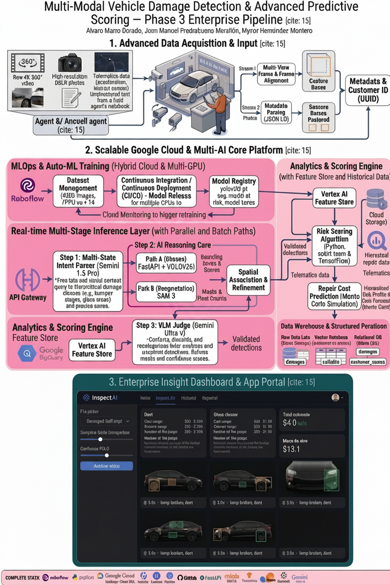

# 🚗 Vehicle Damage Detection — End-to-End AI Pipeline (Phase 2)

**Authors:** Alvaro Marro Dorado · Juan Manuel Piedrabuena Marañón · Mynor Hernández Montero

**Master:** MIOTI — Master en Inteligencia Artificial Avanzada / Master en Deep Learning

**Repo Fase 1:** [FinalMasterProject_CarDamageDetection](https://github.com/Mynozy/FinalMasterProject_CarDamageDetection)

---

## Arquitectura del Sistema

### Pipeline End-to-End (Phase 2)


La arquitectura completa integra tres capas principales: input (imagen y video), core AI pipeline, y output con interfaz interactiva.

### Visión Enterprise (Phase 3 — Roadmap)



La visión a futuro incluye MLOps con CI/CD, multi-GPU training, Vertex AI Feature Store, y un motor de scoring de riesgo de cliente con telemática.

---

## Pipeline Técnico

```
User Prompt (imagen o video)
        ↓
Intent Parser (Gemini Flash Lite)
→ clases de daño + zonas del auto
        ↓
Zone Detector (SAM 3 zero-shot)
→ recorte de región de interés por zona
        ↓
Damage Detector (YOLO26l fine-tuned)
→ bounding boxes + confianza (6 clases)
        ↓
Segmentation (SAM 3 bbox batch prompt)
→ máscaras pixel-level
        ↓
VLM Judge (Gemini Flash Lite)
→ filtra falsos positivos (reflejos, sombras, líneas de diseño)
        ↓
Severity Classifier (área % + aspect ratio + compacidad)
→ bajo / medio / alto
        ↓
Vehicle Identifier (Gemini Vision)
→ marca, modelo, año
        ↓
Cost Estimator (severidad.csv EUR → prices_dataset.csv USD → repair_costs.json)
→ rango de coste de reparación + horas de mano de obra
        ↓
Structured Report + InspectAI Streamlit App
```

### Modo Video

```
Video Upload (MP4/MOV)
        ↓
YOLO26 → todos los frames (frame a frame)
        ↓
SAM 3 batch → solo frames con detecciones
        ↓
Deduplicación por clase (mayor confianza)
        ↓
VLM Judge → top 6 daños únicos
        ↓
Vehicle Identifier + Cost Estimator
        ↓
Video output MP4 con detecciones dibujadas (descargable)
```

---

## Notebooks

| # | Notebook | Descripción |
|---|----------|-------------|
| 01 | `01_YOLO26_training.ipynb` | Fine-tuning YOLO26l sobre dataset Roboflow (4328 imgs, 6 clases). Comparativa YOLOv11l vs YOLO26l. mAP50: 0.759 |
| 02 | `02_sam3_pipeline.ipynb` | Segmentación con SAM 3 — zero-shot por texto y bbox prompt batch |
| 03 | `03_pipeline_completo.ipynb` | Pipeline end-to-end: intent parser + zone detector + YOLO + SAM + cost estimator |
| 04 | `04_vlm_judge.ipynb` | Juez VLM para filtrado de falsos positivos con Gemini Flash Lite |
| 05 | `05_severity.ipynb` | Clasificador de severidad v2: área + aspect ratio + compacidad |
| 06 | `06_Interfaz_Streamlit.ipynb` | App InspectAI — modo imagen y video, dark theme, logs técnicos |

---

## Resultados YOLO26l vs YOLOv11l

| Métrica | YOLOv11l | YOLO26l | Δ |
|---------|----------|---------|---|
| mAP50 | 0.733 | **0.759** | +0.026 |
| mAP50-95 | 0.588 | **0.608** | +0.020 |
| glass shatter mAP50 | 0.995 | **0.995** | 0.000 |
| tire flat mAP50 | 0.965 | **0.988** | +0.023 |
| lamp broken mAP50 | 0.924 | **0.949** | +0.025 |
| scratch mAP50 | 0.528 | **0.556** | +0.028 |
| dent mAP50 | 0.570 | **0.609** | +0.039 |
| crack mAP50 | 0.416 | **0.455** | +0.039 |

YOLO26l gana en todas las clases. La mayor mejora se da en `crack` y `dent` — exactamente las clases más difíciles por su variabilidad visual.

---

## Clases del Modelo

| Clase | Descripción |
|-------|-------------|
| `scratch` | Rayones y abrasiones en la pintura |
| `dent` | Abolladuras en la chapa |
| `glass shatter` | Cristales rotos (parabrisas, ventanas) |
| `crack` | Grietas estructurales en plástico o metal |
| `lamp broken` | Faros o pilotos rotos |
| `tire flat` | Neumáticos pinchados o dañados |

---

## Severidad v2

El clasificador de severidad combina tres métricas geométricas de la máscara de SAM 3:

- **Área (%):** porcentaje de píxeles de la máscara sobre el total de la imagen
- **Aspect ratio:** elongación del bounding box — un scratch largo tiene ratio > 2
- **Compacidad:** ratio máscara/bbox — un scratch fino tiene compacidad < 0.3

El boost de severidad se aplica cuando el daño es elongado y poco compacto, corrigiendo el caso donde área sola subestima scratches largos y delgados.

---

## Cost Estimator

Pipeline de estimación en tres niveles (Juan Manuel Piedrabuena Marañón):

1. **severidad.csv** — precios mercado español (EUR) por clase y nivel de severidad
2. **prices_dataset.csv** — precios mercado US (USD) como referencia secundaria
3. **repair_costs.json** — fallback genérico por clase

El estimador recibe marca, modelo y año del vehículo (identificado por Gemini Vision) para ajustar los precios al mercado correspondiente.

---

## InspectAI — Interfaz Streamlit

App de demo desplegada en Google Colab + ngrok.

**Modo Imagen:**
- Upload de imagen + prompt en lenguaje natural
- Pipeline completo con logs técnicos en tiempo real
- Detecciones con bboxes y máscaras SAM 3
- Desglose por daño con miniatura, severidad, confianza y coste

**Modo Video:**
- Upload de video MP4/MOV
- YOLO26 frame a frame → SAM 3 en frames con detecciones
- Deduplicación por clase (mayor confianza)
- Juez VLM sobre top 6 daños únicos
- Video output descargable con detecciones dibujadas

---

## Limitaciones Documentadas

- **Glass shatter desde ángulo lateral:** el modelo no detecta cristales rotos cuando la cámara no tiene visibilidad directa del plano del cristal. Es un gap del dataset de entrenamiento, no del pipeline.
- **Quota Gemini Free Tier:** 15 requests/minuto. El juez VLM aplica retry automático con 5s de espera en 429, y limita el análisis a los 6 daños de mayor confianza en modo video.
- **Latencia SAM 3:** ~3-5s por llamada en T4. En modo imagen se usa batch; en modo video solo en frames con detecciones.

---

## Stack Tecnológico

| Categoría | Tecnología |
|-----------|-----------|
| Detección | YOLO26l (Ultralytics 8.4.76) |
| Segmentación | SAM 3 (Ultralytics wrapper) |
| VLM / LLM | Gemini gemini-3.1-flash-lite (Google) |
| Dataset | Roboflow (4328 imágenes) |
| Training | Google Colab T4, PyTorch |
| Interfaz | Streamlit + ngrok |
| Video | OpenCV, ffmpeg (H.264) |
| Validación | Pydantic 2.10.6 |
| Entorno | Python 3.12, google-genai 2.9.0 |

---

## Estructura del Repo

```
FinalMasterProject_CarDamageDetection_v2/
├── 01_YOLO26_training.ipynb
├── 02_sam3_pipeline.ipynb
├── 03_pipeline_completo.ipynb
├── 04_vlm_judge.ipynb
├── 05_severity.ipynb
├── 06_Interfaz_Streamlit.ipynb
├── Diagrama_Arqui.jpeg
├── ArquitecturaComplejaDef__1_.png
└── Imagenes Prueba/
```

---

## Fase 1

El modelo base y el dataset fueron desarrollados en la Fase 1:
[FinalMasterProject_CarDamageDetection](https://github.com/Mynozy/FinalMasterProject_CarDamageDetection)
